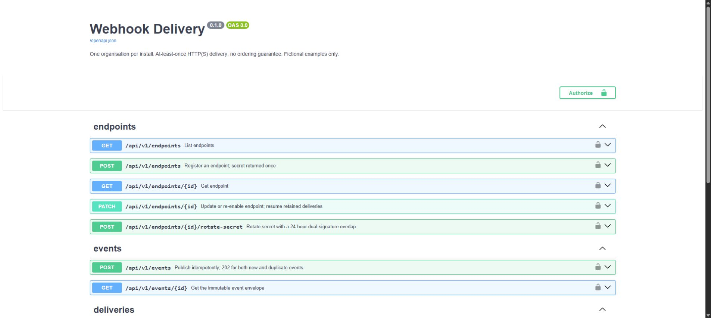

# Webhook Delivery

A self-hostable Node.js and TypeScript service that accepts events from an application and delivers signed HTTP requests to subscribed endpoints. PostgreSQL stores events, delivery jobs and attempt history together. Built as a standalone precursor to the webhook and integration-log requirements of Akash Damle's planned CRM.


[](LICENSE)
[](https://github.com/code-kasha/webhook-delivery/actions/workflows/ci.yml)

[API reference](docs/api.md) · [Design and trade-offs](docs/design.md) · [Receiver verification](docs/receiver.md) · [Deployment](docs/deployment.md) · [Contributing](CONTRIBUTING.md)



<!-- Add release/image badges after those resources exist. -->

- **Endpoints:** event subscriptions, disable/resume and signing-secret rotation with a 24-hour overlap.
- **Publishing:** admin or publish-only API keys; concurrent requests with the same idempotency key create one event and one fan-out.
- **Delivery:** HMAC-SHA256 signatures, bounded HTTP requests, exponential retry delays with jitter, a failed-delivery queue and manual replay.
- **Failure isolation:** one in-flight delivery per endpoint; five consecutive failures automatically pause that endpoint while subscribed events remain queued.
- **Delivery history:** each attempt records its outcome, response code, elapsed time and a truncated response; query by event or endpoint.
- **API contract:** Zod request schemas generate committed OpenAPI and locally served Swagger UI.
- **Operations:** PostgreSQL leases recover interrupted work, process and database probes, JSON logs and graceful shutdown.

> **Status:** public, unreleased implementation targeting v1.0.0. The [controlled demo / Swagger UI](https://webhook-delivery-demo.onrender.com/docs) is live; API credentials stay private. No release or published image exists yet. See the [next tasks](docs/tasks.md) and [release checklist](docs/release.md).

The demo is planned to end on **28 December 2026**. Render free services sleep after 15 minutes without inbound traffic, stopping the delivery worker until the API wakes; the first request can be slow. This is a fictional demonstration, not an always-on service. See [deployment details](docs/deployment.md#render--neon-demo).

Follow the [reviewer walkthrough](docs/walkthrough.md) to exercise delivery, rotation, pause/resume and replay.

## Quick start

Run these commands from this checkout. Requires Docker Desktop/Engine for the first option, or Node.js 22.14+ and PostgreSQL 17+ for the second. Use pnpm 10.17.1 (the version pinned in `package.json`).

**With Docker:** copy `.env.example` to `.env`, generate an encryption key, and replace `SECRET_ENCRYPTION_KEY` in `.env` with the printed value:

```sh
node -e "console.log(require('crypto').randomBytes(32).toString('hex'))"
docker compose up --build -d
docker compose exec api node dist/cli.js key admin
```

If Node is unavailable on the host, generate the key with `docker run --rm node:22-bookworm-slim node -e "console.log(require('crypto').randomBytes(32).toString('hex'))"`.

The key command prints a bearer token once. Keep it private. Open [Swagger UI](http://127.0.0.1:3000/docs), select **Authorize**, and paste the token. PostgreSQL data survives `docker compose down`; `docker compose down -v` deletes it. The Compose credentials and loopback ports are for local development.

**Without Docker:** use an existing PostgreSQL database owned by your application role. Copy `.env.example` to `.env`, set `DATABASE_URL` and a newly generated `SECRET_ENCRYPTION_KEY`, then:

```sh
pnpm install --frozen-lockfile
node --env-file=.env --import tsx src/cli.ts migrate
node --env-file=.env --import tsx src/cli.ts key admin
pnpm build
node --env-file=.env dist/main.js
```

No script loads `.env` implicitly. Use `node --env-file=.env` as above, or export environment variables before invoking pnpm scripts. Never regenerate the encryption key while retaining the database: existing signing secrets would become unreadable.

## Try a delivery

For a local receiver, set `ALLOW_PRIVATE_DESTINATIONS=true` in `.env` and restart the service. This is an explicit opt-in for development/private installations; keep it `false` on an Internet-facing install.

1. Register an endpoint with `POST /api/v1/endpoints`, using `{"url":"http://127.0.0.1:4000","event_types":["lead.created"]}`. For Docker Desktop, use `http://host.docker.internal:4000` and set `RECEIVER_HOST=0.0.0.0` in the receiver shell; its default is loopback. See [receiver setup](docs/receiver.md). After changing the Compose environment, run `docker compose up -d` to recreate the API; `docker compose restart` does not reload `.env`.
2. Copy the returned signing secret into `WEBHOOK_SECRET` in your shell; run `pnpm receiver` in another terminal. See [receiver setup](docs/receiver.md) for shell commands.
3. Publish with `POST /api/v1/events`, header `Idempotency-Key: fictional-lead-001`, and `{"type":"lead.created","data":{"name":"Fictional Customer"}}`.
4. Query `/api/v1/deliveries?event_id=<returned-id>` and `/api/v1/attempts?event_id=<returned-id>`.

All examples are fictional. The receiver helper operates on raw body bytes, before parsing JSON. A timestamp check limits replay age; receivers must also persist event IDs to avoid duplicate business actions.

## Delivery guarantees

Publishing stores the event, its subscription snapshot and the audit entry in one transaction. A `202` means the event is durable, not that receivers have accepted it. Delivery is **at least once**, with bounded retries and manual recovery. A receiver can accept a request just before the worker loses its database connection, causing a later duplicate.

There is **no ordering guarantee**: a newer event can succeed while an older one waits for a retry. Pausing or disabling retains existing and newly subscribed events. Re-enabling resumes pending work; exhausted deliveries require manual replay. Subscription edits affect future publishes, while URL edits affect subsequent attempts for existing jobs.

Each delivery has eight attempts per replay cycle. Five consecutive known failures pause the endpoint first; an operator must re-enable it before remaining attempts can run. Replay resets the cycle budget and retains lifetime attempt history.

## For developers

```text
src/contract.ts        Zod inputs and OpenAPI route definitions
src/app.ts             HTTP handlers and scoped API-key authentication
src/service.ts         transactional endpoint/event/key operations
src/worker.ts          claims, leases, retry state and attempt history
src/destination.ts     URL and resolved-IP policy
src/send.ts            pinned DNS, bounded HTTP transport, no redirects
src/verify.ts          standalone receiver verification module
migrations/           versioned PostgreSQL schema
tests/                security/HTTP tests and real PostgreSQL integration tests
examples/receiver.ts   fictional receiver with demo-only in-memory deduplication
```

Tests create a unique temporary schema in the database selected by `TEST_DATABASE_URL` and remove that schema afterward. The role must have schema-creation permission. The local default is the Compose database at `localhost:55432`; no tests contact Neon or external receivers. The HTTPS tests generate throwaway certificates with the `openssl` CLI and are reported as skipped when it is not on `PATH`.

```sh
pnpm lint
pnpm typecheck
pnpm test
pnpm build
pnpm openapi:check
docker build -t webhook-delivery:local .
```

CI runs these checks with Node 22 and 24 and a PostgreSQL service container, plus a smoke test of the running image on the Node 22 job. The [first GitHub run](https://github.com/code-kasha/webhook-delivery/actions/runs/36322054815) passed on both versions. The [design page](docs/design.md) explains the choice of explicit SQL instead of an ORM, queue recovery and security limits. [Verification notes](docs/verification.md) record actual local/CI results and remaining checks.

## Credits

Built by **Akash Damle** ([akashdamle.in](https://www.akashdamle.in) · [@code-kasha](https://github.com/code-kasha)), with **Claude** (Anthropic) and **Codex** (OpenAI) as AI pair programmers.
