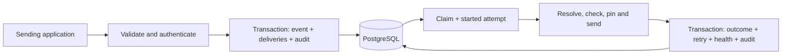

# Design and trade-offs

## Scope and stack

Akash confirmed the name, full v1 scope and PostgreSQL tests on 27 September 2026. One organisation per install; no UI, tenant isolation or non-HTTP transports. This is a precursor to a planned CRM, not the CRM itself.

Node 22+, strict TypeScript, Fastify 5, Zod 4 with zod-to-openapi, PostgreSQL, Vitest and pnpm follow the suggested stack. We use `pg` and explicit parameterized SQL instead of Drizzle/Kysely: the small schema and queue are the core of this project, and keeping row locks, conditional writes and transaction boundaries visible makes them easier to review. The trade-off is manual row typing and migrations rather than generated database types. TypeScript 5.9 is deliberately pinned; upgrading the compiler is separate from implementing the service.

## Transaction boundaries

Endpoint mutations and key mutations write an audit entry in the same transaction. A publish inserts the event with a unique organisation-wide idempotency key, snapshots every matching endpoint into deliveries, then appends the audit entry. The unique constraint serializes competing publishes. An unchanged request returns the original ID; a different canonical type/data returns 409. Object key order is ignored recursively; array order is significant. Keys are retained as long as events are retained. There is no automatic expiry or deletion API.

Fan-out takes its subscription snapshot at the `INSERT ... SELECT` statement under PostgreSQL's default READ COMMITTED isolation. A concurrently registered subscription may be included or excluded according to that statement's snapshot. Paused and disabled subscriptions are included. Changing event types affects future snapshots; URL and signing-secret changes affect the next claim of existing jobs. An already claimed request may still use the previous URL or secret.

## Queue, ownership and failures

Workers select an eligible endpoint with `FOR UPDATE SKIP LOCKED`, then lock and claim one due delivery. Under READ COMMITTED the selection snapshot can predate a competing claim that committed before the endpoint lock was granted, so the in-flight row is re-read after locking: a live lease makes the claimer back off, and only a lease whose expiry has passed is recovered. A partial unique index permits one in-flight delivery per endpoint. Different endpoints can progress concurrently. No network request happens inside the transaction. The database pool is bounded; one process runs four worker loops.

Claiming increments the lifetime and current-cycle attempt counts, writes a `started` attempt, and assigns a random lease token with a 60-second expiry. HTTP work has a 10-second total deadline. Finalization locks the endpoint first, then the delivery, and requires the same token. It atomically records the result, changes the job state, updates endpoint health and appends audit history. The consistent lock order also applies to replay. If finalization fails because PostgreSQL is briefly unreachable, the worker retries it with backoff until the lease period ends; the token fence makes a repeated finalization harmless. Only after that does the outcome fall back to crash recovery. A connection lost while a transaction holds it is discarded rather than returned to the pool, and the original error is preserved.

After a crash, the next eligible claim marks an expired attempt `unknown` (the receiver may have accepted it), clears the old lease and retries or fails it when its budget is spent. Expiry of the final allowed claim marks the delivery `failed` and audits both the expiry and the failure. Unknown outcomes count toward the attempt budget but do not count as a known endpoint failure. A paused/disabled endpoint's expired work is recovered when it is re-enabled. A recovered lease gets a new token; a stale worker cannot overwrite its successor's result. These are database ownership guarantees, not exactly-once network effects.

Every non-2xx response, DNS/policy refusal, timeout, transport failure or response-cap violation is a failure. Redirects are logged as failures and never followed. Eight attempts are allowed per replay cycle. After failure number `n`, delay is `floor(min(3600000, 1000 * 2^(n-1)) * U[0.5, 1))` milliseconds. The first retry waits 500–999 ms. `Retry-After` is not interpreted in v1. Exhausted deliveries have status `failed`; this indexed relational queue needs no separate broker.

Five consecutive known failures pause the endpoint, even before the eight-attempt budget is exhausted. This deliberately requires an operator to investigate and re-enable it. Re-enabling resets the failure streak and resumes pending work; it does not replay exhausted jobs. Replay resets the cycle budget but preserves the event ID, delivery ID, lifetime count and history. Receivers deduplicate by the signed event ID and may therefore ignore a manual replay they already processed.

Retries release their endpoint slot. A later event can overtake a delayed one: **no ordering guarantee**. We choose failure isolation over strict FIFO/head-of-line blocking. Durable queues can grow while endpoints are paused, so operators must monitor backlog and disk usage. There is no retention scheduler, external broker, metrics exporter or autoscaling controller in v1.

## Security boundaries

- API keys contain 256 bits of random entropy; only SHA-256 hashes are stored. `admin` can manage and publish; `publish` can only submit events. Revocation applies to the next authentication check, not a request already in progress.
- Endpoint signing secrets are encrypted with AES-256-GCM under an operator-provided 32-byte key. Losing that key makes stored secrets unusable. Key-encryption-key rotation is an offline operation, not the signing-secret rotation API.
- Rotation lasts 24 hours. Each delivery carries HMACs under both secrets during the overlap. Further rotation returns 409 until the overlap ends, judged by the database clock. Expired ciphertext may remain stored until the next rotation but is no longer used for signing.
- URLs must be HTTP(S), with no userinfo or fragment. IP literals, normalized numeric aliases, and all DNS answers are checked; only ordinary public unicast ranges are accepted by default; IPv6 must also be inside global unicast `2000::/3`, which excludes unallocated space and the IPv4-compatible `::/96` form. Loopback, private, link-local, multicast, reserved and transition ranges are refused. An explicit setting permits private networks.
- DNS is checked on registration/update (five-second deadline) and on every attempt. The HTTP connection uses the selected checked IP through a custom `lookup`; the original Host header and TLS hostname remain intact. This avoids a second unchecked lookup between validation and connection. If any answer is forbidden, the whole destination is refused. Only the first allowed answer is attempted; address failover waits for the next retry.
- No redirects or ambient HTTP proxy are used. Outbound response headers are capped at 16 KiB, bodies at 64 KiB, retained response text at 2 KiB, and the total operation (including DNS and body reading) at 10 seconds. Compressed responses are not decompressed. Inbound JSON is capped at 256 KiB.
- Logs omit authorization headers and event bodies. Response excerpts can contain receiver-provided sensitive data; attempt APIs require admin scope. Restrict database and log access and choose a retention policy before using real customer data.

The destination policy cannot inspect an external service's own forwarding behavior. Deploy with an outbound firewall as a second boundary when your network requires one. Exposing a public admin credential would allow arbitrary public HTTP requests; the demo must not publish an admin key.

## Operations and limits

`/health` is process liveness; `/ready` checks the migration marker and database connectivity and fails while draining. It does not assert receiver availability, worker throughput or absence of queue lag. Shutdown stops claims, drains HTTP work and finalizes it before closing PostgreSQL. Forced termination leaves leases recoverable. Back up the database and encryption key together.

Reference semantics: PostgreSQL documents [SKIP LOCKED for queue-like consumers](https://www.postgresql.org/docs/current/sql-select.html); Node documents the [HTTP lookup hook and request lifecycle](https://nodejs.org/docs/latest-v22.x/api/http.html). The implementation uses explicit abort/destruction because a socket inactivity timeout alone is not a total operation deadline. Zod integration follows [zod-to-openapi](https://github.com/asteasolutions/zod-to-openapi).
